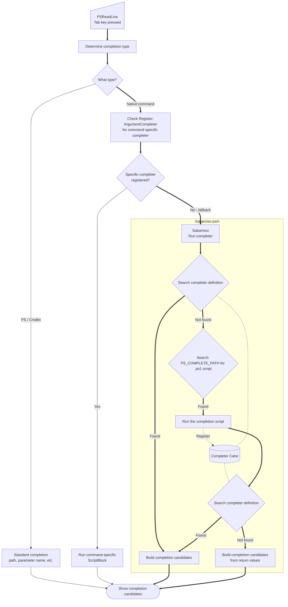

# Sabamiso.psm


**Sabamiso.psm** is a fish-inspired completion framework for PowerShell.

It provides a structured, extensible way to define completions for *native commands*,
drawing inspiration from the expressive completion format of the **fish shell**.

This approach ensures fast startup times.
Additionally, the completions provided by this module are designed to have low priority, ensuring they do not interfere with custom completion scripts for specific commands.

Sabamiso.psm itself provides only the framework for defining completions.
Actual completion definitions for individual commands are maintained separately in the **[Sabamiso.completions]** project.

## 🎥 Demo


## 🚨 Requirements

 - PowerShell >= 7.6.0-preview.5

## 🚀 Build & Install

### 1.a. Install from PowerShell Gallery

```powershell
Install-Module -Name Sabamiso.psm
```

> [!NOTE]
> `Sabamiso.psm` provides only the completion framework.
> To install completion definitions for individual commands, please install [Sabamiso.completions].
>
> ```powershell
> Install-Module -Name Sabamiso.completions
> ```

[Sabamiso.completions]: https://github.com/teramako/Sabamiso.completions

### 1.b. Build from this repository

#### 1.b.1. Clone this repository

```powershell
cd path/to/dir
git clone https://github.com/teramako/Sabamiso.psm.git
```

#### 1.b.2. Build

```powershell
cd Sabamiso.psm
dotnet build ./src
```

#### 1.b.3. Put the module into `$env:PSModulePath`

```powershell
cd ($env:PSModulePath -split [System.IO.Path]::PathSeparator)[0]
ln -s path/to/dir/Sabamiso.psm
```

### 2. Edit profile

Edit the profile loaded at PowerShell startup

```powershell
& $env:EDITOR $PROFILE
```

Add the following code:

```powershell
Import-Module -Name Sabamiso.psm
```

> [!NOTE]
> If you have installed [Sabamiso.completions], please import that module as well.
>
> ```powershell
> Import-Module -Name Sabamiso.completions
> ```

> [!TIP]
> I recommend changing the style of the selection.
> ```powershell
> Set-PSReadLineOption -Colors @{
>     Selection = $PSStyle.Reverse;
> }
> ```

## ⚙️ Settings

### Environement Variable: `PS_COMPLETE_PATH`

Path(s) of the directory where the completion scripts for each command are located.
(The path separator is `;` on Windows and `:` on Unix-like OS)
The target file (`{command-name}.ps1`) is searched and read during completion dymanically.
Once loaded and registered, the completion code is cached and will not be reloaded until it is unregistered.

If not specified, the `{profile directory}/completions` and `{module directory}/completions` directories are set automatically.

## Completion definitions

Completion definitions for common commands are available as a separate module: [Sabamiso.completions]

## 📊 Module Workflow



## 📚 Write completion scripts

### Cmdlets

| Cmdlet                       | Description                                    |
|:-----------------------------|:-----------------------------------------------|
| [New-CommandCompleter]       | Create a CommandCompleter object.              |
| [New-ParamCompleter]         | Create a parameter's completer.                |
| [New-ArgumentCompleter]      | Create an argument definition.                 |
| [New-ParamStyle]             | Create or get parameter style instance.        |
| [Register-NativeCompleter]   | Create and register a CommandCompleter object. |
| [Unregister-NativeCompleter] | Unregister the command completer.              |

[New-CommandCompleter]: docs/Sabamiso.psm/New-CommandCompleter.md "Cmdlet - New-CommandCompleter"
[New-ParamCompleter]: docs/Sabamiso.psm/New-ParamCompleter.md "Cmdlet - New-ParamCompleter"
[New-ArgumentCompleter]: docs/Sabamiso.psm/New-ArgumentCompleter.md "Cmdlet - New-ArgumentCompleter"
[New-ParamStyle]: docs/Sabamiso.psm/New-ParamStyle.md "Cmdlet - New-ParamStyle"
[Register-NativeCompleter]: docs/Sabamiso.psm/Register-NativeCompleter.md "Cmdlet - Register-NativeCompleter"
[Unregister-NativeCompleter]: docs/Sabamiso.psm/Unregister-NativeCompleter.md "Cmdlet - Unregister-NativeCompleter"

Write the definition of command completion using the Cmdlets above.

### Examples

#### Example 1. Define basic options

Edit: example1.ps1 in `${env:PS_COMPLETE_PATH}`

```powershell
Register-NativeCompleter -Name example1 -Parameters @(
    # [-h, --help] -- Flag
    New-ParamCompleter -ShortName h -LongName help -Description 'Display help'

    # [-v, --version] -- Flag
    New-ParamCompleter -ShortName v -LongName version -Description 'Display version'

    # [--type {typeA|typeB|typeC}] -- Options that require an argument
    New-ParamCompleter -LongName type -Description 'Select type' -Arguments @{
        Name = "TYPE";
        Candidates = @(
            "typeA `tDescription A",
            "typeB `tDescription B",
            "typeC `tDescription C"
        )
    }
)
```

#### Example 2. Define subcommands

Edit: example2.ps1 in `${env:PS_COMPLETE_PATH}`

```powershell
Register-NativeCompleter -Name example2 -SubCommands @(
    # example2 add ...
    New-CommandCompleter -Name add -Description "Add something files" -Arguments @{
        Name = "FILE";
        Type = 'File';
        Nargs = '1+';
    }

    # example2 list ...
    New-CommandCompleter -Name list -Description "Print a list" -Parameters @(
        # [-a, --all] -- Flag
        New-ParamCompleter -ShortName a -LongName all -Description 'Show all'
    )
)
```

#### Example 3. Use `posh-git`'s completion

Edit: `git.ps1` in `<profile directory>/completions`

```powershell
<#
.SYNOPSIS
    Regsiter `git` command completer with `posh-git`
.DESCRIPTION
    This script will be loaded by `Sabamiso.psm` poershell module.
.LINK
    dahlbyk/posh-git: A PowerShell environment for Git
    https://github.com/dahlbyk/posh-git
#>
param($wordToComplete, $commandAst, $cursorPosition)
Import-Module posh-git

# Reset the variable in the global scope
$global:GitPromptScriptBlock = $GitPromptScriptBlock

# The first time, generate the completion list manually
TabExpansion2 -inputScript $commandAst.ToString().PadRight($cursorPosition) `
              -cursorColumn $cursorPosition `
    | Select-Object -ExpandProperty CompletionMatches
```

This code is not executed when PowerShell starts up and loads the profile.
It is loaded the first time tab completion for the `git` command is triggered.

#### Example 4. Use `dotnet complete`'s completion

Edit: `dotnet.ps1` in `<profile directory>/completions`

```powershell
<#
.SYNOPSIS
    Regsiter `dotnet` command completer
.DESCRIPTION
    This script will be loaded by `Sabamiso.psm` poershell module.
.LINK
    How to enable tab completion for the .NET CLI
    https://learn.microsoft.com/en-us/dotnet/core/tools/enable-tab-autocomplete
#>
param($wordToComplete, $commandAst, $cursorPosition)

Register-ArgumentCompleter -Native -CommandName dotnet -ScriptBlock {
    param($wordToComplete, $commandAst, $cursorPosition)
    dotnet complete --position $cursorPosition $commandAst.ToString() | ForEach-Object {
        [System.Management.Automation.CompletionResult]::new($_, $_, 'ParameterValue', $_)
    }
}
# The first time, generate the completion list manually
TabExpansion2 -inputScript $commandAst.ToString().PadRight($cursorPosition) `
              -cursorColumn $cursorPosition `
    | Select-Object -ExpandProperty CompletionMatches

```

The example and mechanism are almost identical to those of `posh-git` in Example 3.

The completion provided by `Sabamiso.psm` has a lower priority;
if a completion code with a specified command name is registered, completion will be performed using that code.
